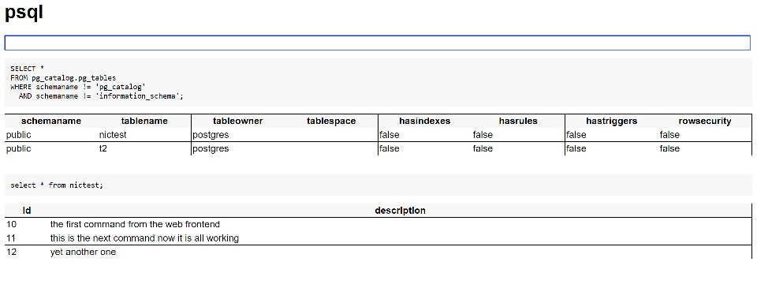

# PgBoot - booting postgres databases with Keepie

pgBoot started out just as an example of Keepie, showing how to boot a
whole database securely, without ever knowing the password.

It turned out to be a useful thing for me though, so I've gradually
extended it to be more and more useful for a developer.

## Features

* it creates a pg cluster (initdb) if one does not exist
 * the cluster has locale POSIX, or *C* in Postgresql convention
 * the cluster is owned by user `postgres`
 * the cluster has encoding UTF8
* it allocates a random port to the db every time it starts
* it starts the db in that cluster
* it changes the password of the `postgres` user
* it rewrites the `pg_hba` file and reloads the server config
 * the server now can only be accessed with the keepie provided password
* it applies the SQL it finds in a sql-scripts directory to the running DB


## What operating systems support pgBoot.js?

pgBoot.js has been tested on:

* Windows 10 with postgresql 10
* Ubuntu 16 with postgresql 10
* RedHat Enterprise Linux 7


## Using pgBoot.js on the command line

If you have cloned this repository or npm installed keepie, you can
use pgBoot.js to run your own Keepie based service with Postgresql.

Change to the directory with pgBoot.js and run it as a server on its
own:

```sh
node pgBoot.js 5000
```

will start a server on port 5000 routing its own service and a keepie
service which will authorize itself and hand out the password
"Secret1234567!".

It will boot its own Postgres using whatever method it can find, or
die.

## Using pgBoot.js as a module

You still have to use its server:

```javascript
const pgBoot = require("keepie").pgBoot;

pgBoot.boot(8004, {
   appCallback: function (app) {
     app.get("/status", function (req, res) {
        res.json({ up: true });
     });
   }
});
```

pgBoot.js allows you to start the server and provide additional routes
through an `appCallback`.

There's also a `listenerCallback`. See customization below.

pgBoot.js also provides an event interface. This is the only way to
receive the connection detail from Keepie right now:

```javascript
const pgBoot = require("keepie").pgBoot;

pgBoot.events.on("dbUp", async dbDetails => {
   let { pgPool } = dbDetails;
   let client = pgPool.connect();
   try {
      let result = await client.query("SELECT now();");
      return result;
   }
   finally {
      client.release();
   }
});
```

The events that pgBoot.js sends are:

* `sqlFile` - a sql file is being executed, passed the filename of the file
* `dbUp` - the db has been started, the pg pool to connect is a parameter


## Customizing pgBoot.js

If you run pgBoot.js you can pass several options to it to configure
it:

* `secretPath` - the path which your handler is using to receive
  requests from keepie; you will have to configure this in a keepie
  authorizing your service
* `keepieUrl` - the URL to send Keepie authorization requests to; this
  is also picked up from the environment variable KEEPIEURL though the
  option takes precedence; by default this is the local pgBoot server,
  which makes development easier
* `serviceName` - the authorization name, the service to request authorization for
* `pgBinDir` - a place where we'll find the pg binaries, we'll try to guess if not specified
* `appCallback` - a function, called with the express app so you can configure routes.
* `listenAddress` - `undefined` or an address to listen on, eg: `"localhost"`, see [express](https://expressjs.com/en/4x/api.html#app.listen) for more details.
* `listenerCallback` - a function, called with the listener address so you can enquire of the listener.
* `sqlScriptsDir` - a path to a directory containing SQL scripts to initialize the db
* `dbDir` - a path to where to store the db files
* `pgPoolConfig` - see [pgPool](https://node-postgres.com/api/pool) about config for the postgres connection pool

*Note: in `pgPoolConfig` authentication or host details are ignored.*

## How does pgBoot.js guess where the PG binaries are?

pgBoot.js is looking for `initdb` and `postgresql` binaries and uses
some tricks to find them on installations that I know.

The first trick is quite portable though, it looks in `PGBIN`
environment variable.

This variable can point to the bin directory where `initdb` and
`postgresql` binaries are. If the variable exists and points to a
thing then it is accepted as truth.


## SQL scripts and initialization

Through the option `sqlScriptsDir` pgBoot.js will apply sql scripts
whenever it starts the database.  

But pgBoot.js makes no attempt to keep versioning of these scripts so
*you must write these scripts to apply safely* to the database.

## A full end to end example of pgBoot.js

[See here](https://github.com/nicferrier/keepie/blob/master/pgbootdemo.js)
for a full example of how to configure and work with pgBoot.js to
start and use a Postgresql database.

## Command to create a pgBoot.js demo

Keepie includes a `makepg` command to create a simple demo keepie:

```sh
mkdir somejsdir
cd somejsdir
npm init -f
npm install keepie
node node_modules/keepie/server.js makepg
```

will make a `boot.js` that is an instance of a pgBoot.js. You can run
it with:

```sh
node boot.js
```

## Web based SQL command line

Another trick of pgBoot is the SQL command line tool available from a
web browser.

Simply go to:

```
http://yourserver:PORT/psql
```

and you'll see a basic command line for interacting with PostgreSQL.



| Key        | description                             |
|------------|-----------------------------------------|
| Ctrl+Enter | sends a SQL statement to Postgres       |
| Alt+t      | makes the current query a table lookup  |
